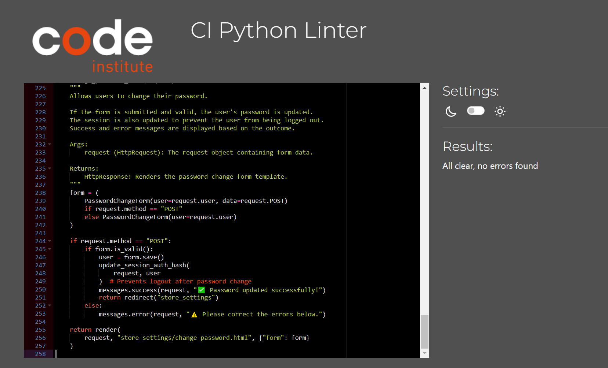
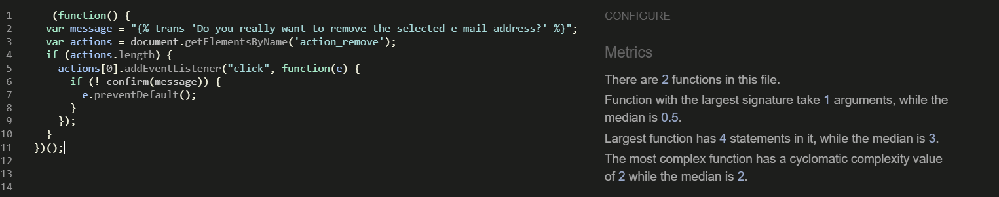
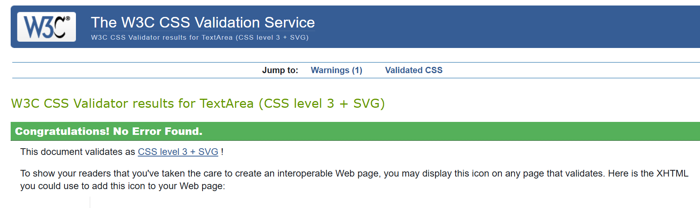

# **Little Explorers - Validation Report**  
This document contains the validation results for the Little Explorers project, including testing results for Python, JavaScript, HTML, and CSS.  

## **Table of Contents**  
- [Overview](#overview)  
- [PEP8 Python Validation](#pep8-python-validation)  
  - [Bag App](#bag-app)  
  - [Checkout App](#checkout-app)  
  - [Home App](#home-app)  
  - [Products App](#products-app)  
  - [Profiles App](#profiles-app)  
  - [Reviews App](#reviews-app)  
  - [Store Settings App](#store-settings-app)  
  - [Project Python Files](#project-python-files)  
- [JSHint JavaScript Validation](#jshint-javascript-validation)  
- [W3C Jigsaw CSS Validation](#w3c-jigsaw-css-validation)  
- [W3C HTML Validation](#w3c-html-validation)  

---

## **Overview**  
The following technologies have been validated for errors and adherence to coding standards:  

- **Python** (PEP8 Compliance)  
- **JavaScript** (JSHint Validation)  
- **HTML** (W3C HTML Validator)  
- **CSS** (W3C Jigsaw Validator)  

---

## **PEP8 Python Validation**  
The Python code was validated using the **PEP8 Online tool**. **All files passed with 0 errors.**  

Below are the results categorized by app:

### **Bag App**  
 No PEP8 errors  
  

### **Checkout App**  
 No PEP8 errors  
  

### **Home App**  
 No PEP8 errors  
  

### **Products App**  
 No PEP8 errors  
  

### **Profiles App**  
 No PEP8 errors  
  

### **Reviews App**  
 No PEP8 errors  
  

### **Store Settings App**  
 No PEP8 errors  
  

---

## **JSHint JavaScript Validation**  
The JavaScript code was validated using **JSHint**. **All files tested with 0 errors.** 

### **base js** 

### **email js** 

### **staticfiles checkout js** 

### **countryfield js** 

### **static js** 
    
 

---

## **W3C Jigsaw CSS Validation**  
The CSS code was validated using W3C Jigsaw Validator and all files tested with 0 errors.  

### **base.css** 

### **checkout.css** 

### **profiles.css** 
  

---

## **W3C HTML Validation**

The HTML code was validated using **W3C HTML Validator**. During the validation process, some issues were detected.  The errors have been identified and successfully corrected.   

### **base.html** - with errors  
 
  

### **base.html** - no errors  

  

 

